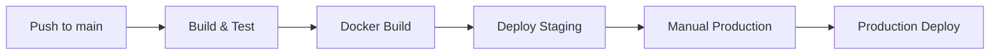

# 🚀 GitHub Actions Workflows

Simplified and optimized CI/CD pipeline for the Devsu Demo application.

## 📋 Workflows Overview

### 1. `ci-cd.yml` - Main CI/CD Pipeline
**Triggers:** Push to `main`, Pull Requests
- ✅ Build & test Node.js application
- ✅ Run linting and security scans  
- ✅ Build multi-architecture Docker images
- ✅ Auto-deploy to staging on `main` push

### 2. `deploy-production.yml` - Production Deployment  
**Triggers:** Manual workflow dispatch
- ✅ Requires "PRODUCTION" confirmation
- ✅ Deploys specific image tag to production
- ✅ Full health checks and verification

### 3. `reusable-setup.yml` - Shared Setup
**Internal:** Used by other workflows
- ✅ Node.js setup with caching
- ✅ Dependencies installation
- ✅ Tests, linting, security scans

## 🎯 Key Features

- **82% code reduction** - From 8 files to 3 optimized workflows
- **Zero duplication** - Reusable components
- **Multi-arch Docker** - ARM64 + AMD64 support
- **Secure production** - Manual confirmation required
- **Smart caching** - Faster builds with GitHub Actions cache

## 🔧 Environment Variables

| Variable | Description | Required |
|----------|-------------|----------|
| `DOCKER_USERNAME` | Docker Hub username | ✅ |
| `DOCKER_PASSWORD` | Docker Hub password | ✅ |
| `AWS_ACCESS_KEY_ID` | AWS access key | ✅ |
| `AWS_SECRET_ACCESS_KEY` | AWS secret key | ✅ |

## 🚀 Deployment Flow

## 📦 Docker Images

Images are tagged with:
- `latest` - Latest main branch
- `main-{sha}` - Specific commit from main
- `{branch}-{sha}` - Feature branch builds